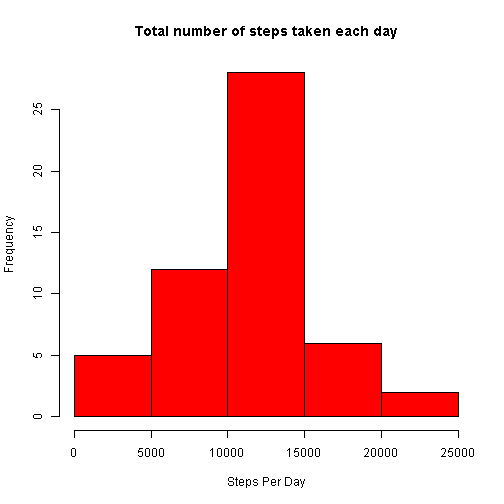
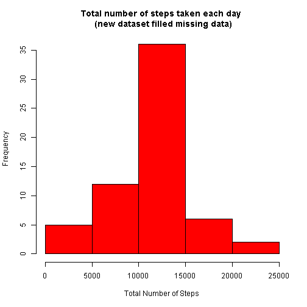
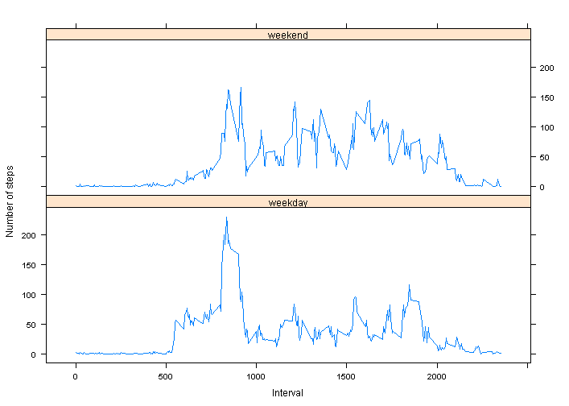

# Reproducible Research: Peer Assessment 1

## Loading and preprocessing the data

```r

# Assume the activity.csv was placed at the same directory as this Rmarkdown
# file.
data = read.csv("activity.csv", header = TRUE, sep = ",", na.strings = "NA")

# tranform date to correct Date format
data$date = as.Date(as.character(data$date), "%Y-%m-%d")
```

## What is mean total number of steps taken per day?

```r
# ignore the missing values
dataTidy = data[!is.na(data$steps), ]

## create histogram of the total number of steps taken each day calculate the
## total sum of steps w.r.t. the date
sumStep = aggregate(steps ~ date, dataTidy, sum)
# plot graph
hist(sumStep$steps, col = "red", main = "Total number of steps taken each day", 
    xlab = "Steps Per Day")
```

 

```r

# disable scientific notation
options(scipen = 999)
# calculate the mean and median total number of steps taken per day
meanStep = mean(sumStep$steps)
medianStep = median(sumStep$steps)
```


* The __mean__ total number of steps taken per day: _10766.1887_
* The __median__ total number of steps taken per day: _10765_


## What is the average daily activity pattern?


```r
## create time series plot of the 5-minute interval and the average number of
## steps taken

# calculate the average of steps w.r.t. the time interval
avgStep = aggregate(steps ~ interval, dataTidy, mean)

# plot graph plot(avgStep$step, type='l', xaxt='n', xlab='5-minute interval
# identifiers', main='Average number of steps across all days',
# ylab='Average number of steps')

# get the interval list
plot(avgStep$interval, avgStep$step, type = "l", xlab = "5-minute interval identifiers", 
    ylab = "Steps", main = "Average number of steps across all days")
```

 

```r

# check which 5-minute interval contains the maximum number of steps
maxIdx = which.max(avgStep$steps)
maxInterval = avgStep[maxIdx, "interval"]
maxAvgStep = avgStep[maxIdx, "steps"]
```

* On average across all the days in the dataset, __835__ 5-minute interval contains maximum number of steps (_206.1698_ steps)

## Imputing missing values

```r
# calulate the total number of missing values in the dataset
totalNA = sum(is.na(data$steps))
```

* The total number of missing values in the dataset: __2304__

To filling all of the missing values in the dataset, I adopted the strategy: using mean of 5-minute interval 


```r

# filling all of the missing values in the dataset STRATEGY: using mean of 5
# minute interval

# get the NA index
naIdx = which(is.na(data$steps))
naInterval = data[naIdx, 3]  #get the corrosponding intervale
fillSteps = sapply(naInterval, function(x) {
    avgStep[(avgStep$interval == x), 2]
})

# create a new dataset that is equal to the orginal dataset BUT with the
# missing data filled in
dataNew = data
dataNew[naIdx, "steps"] = fillSteps  #fill in missing data

# again, calculate the average of steps w.r.t. the time interval
sumStepNew = aggregate(steps ~ date, dataNew, sum)
# plot graph
hist(sumStepNew$steps, col = "red", main = "Total number of steps taken each day \n (new dataset filled missing data)", 
    xlab = "Total Number of Steps")
```

 

```r

# calculate the mean and median total number of steps taken per day
meanStepNew = mean(sumStepNew$steps)
medianStepNew = median(sumStepNew$steps)
```


### After filling the missing values
* The __mean__ total number of steps taken per day: _10766.1887_
* The __median__ total number of steps taken per day: _10766.1887_

The mean number of steps taken per day are the same (10766.1887). 
But, the median number of steps taken per day are slightly different (before filling missing data: 10765, after filling missing data: 10766.1887). It is probably due to filling missing values by the mean of 5 minute interval.


## Are there differences in activity patterns between weekdays and weekends?

```r
# create a new factor variable 'dateIs' with two levels 'Weekday' and
# 'weekend'
dataNew["dateIs"] = factor(sapply(dataNew$date, function(x) {
    if (weekdays(x) == "Sunday" | weekdays(x) == "Saturday") {
        "weekend"
    } else {
        "weekday"
    }
}))

# calculate the average of steps w.r.t. the time interval and dateIs
avgStepDateIs = aggregate(steps ~ interval + dateIs, mean, data = dataNew)

library(lattice)
```

```
## Warning: package 'lattice' was built under R version 3.0.3
```

```r
xyplot(steps ~ interval | dateIs, data = avgStepDateIs, type = "l", layout = c(2, 
    1), xlab = "Interval", ylab = "Number of steps")
```

 

